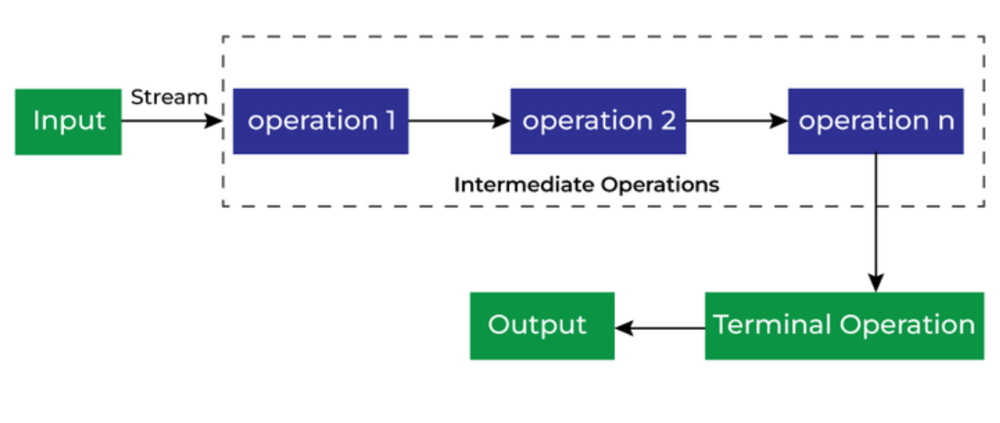

# Java: Documentation
`Java 8`  
   - `Interface`: Contract for classes, without specifying implementation.  
   - `Functional Interface`: An interface with exactly one abstract method, used for lambda expressions.  
   - `Lambda Expressions`: helps represent or implement functional interfaces in a `concise` way.  
   - `Method References`: helps represent or implement functional interfaces in an even more `concise` way  
   - `Pre-defined Functional Interfaces`: Java provides several pre-defined functional interfaces in the `java.util.function` package, which can be used with lambda expressions and method references.  
   - `Streams`: helps process data efficiently.  `Stream pipelines`: Sequence of operations (intermediate + terminal) that are performed on the data in the stream.
  
# Interface
1. Interface defines a contract for classes, without specifying implementation.
2. A class "signs" the contract by with the keyword "implements". When implementing an interface, the class agrees to adhere to the contract defined by the interface.
3. Classes:
   - Can extend one class.
   - Can implement multiple interfaces.
4. Interfaces themselves are implicitly `public` and `abstract`, meaning they cannot be instantiated directly.
5. Interfaces can contain:  
   - Abstract methods (implicitly public and abstract).  
   - Static methods (not inherited by implementation classes).  
   - Default methods (can be inherited, optional to override).  
6. Variables in interfaces are implicitly `public static final`.

# Functional Interface
1. A functional interface is an interface with exactly one abstract method. This is known as a Single Abstract Method (SAM) interface.
2. default methods, static methods, methods inherit from Object are excluded from the abstract method count. Therefore,functional interface can have multiple default or static methods.
3. The `@FunctionalInterface` annotation is used to indicate that an interface is intended to be a functional interface. This annotation is optional but helps in ensuring that the interface adheres to the functional interface contract. If an interface is annotated with `@FunctionalInterface`, it must have exactly one abstract method. If it has more than one abstract method, the compiler will generate an error.

```
@FunctionalInterface
public interface MyFunctionalInterface {
    void myMethod(); // Single abstract method
 
    default void defaultMethod() {
        System.out.println("Default method implementation");
    }
    
    static void staticMethod() {
        System.out.println("Static method implementation");
    }
}
```


# Lambda Expressions: helps represent or implement functional interfaces in a `concise` way
1. Lambda expressions helps to `represent or implement functional interfaces in a more concise way`. They allow you to define the behavior of a functional interface without the need for an explicit class implementation.
2. Functional interfaces are generally used as the assignment target for a lambda expression or method reference.
3. Lambda expressions can be used to create instances of functional interfaces without the need for an explicit class implementation.
4. Lambdas make heavy use of compiler inference, relying on the functional interface's structure to determine method targets.

```
@FunctionalInterface
public interface MyFunctionalInterface {
    void myMethod(String message);
}

public class Main {
    public static void main(String[] args) {
        // Using a lambda expression to implement the functional interface
        MyFunctionalInterface myFunc = (message) -> System.out.println("Message: " + message);
        
        // Calling the method defined in the functional interface
        myFunc.myMethod("Hello, World!");
    }
}
```
Left side () = input parameters (empty if none).  
Arrow -> separates parameters from the method body.  
5. In Java, lambda expressions can only access:  
   ✔️ Parameters or Local variables of the enclosing method or block; and those variables must be `final` or `effectively final`

## What is Effectively Final?
A variable is considered effectively final if:  
✅ It is assigned once.  
✅ Its value is never changed after initialization.  
✅ You don't explicitly use the final keyword, but the compiler treats it as final.

```
public class LambdaScopeExample {

   public static void main(String[] args) {
      int z = 5;  // Effectively final

      Runnable lambda = () -> {
         System.out.println("Value of z: " + z);
      };

      lambda.run();
   }
}

// value of z is never modified after it's initialized, so it is effectively final.
```

# Method References: helps make lambda expressions even more `concise`
1. Method references `helps to make lambda expressions even more concise` in cases where the lambda expression is simply calling an existing method.
2. **_If a lambda expression is just a call to an existing method, you can use a method reference to refer to that method directly._**
3. **_If a lambda parameter is simply passed to another method, then the redundancy of specifying the parameter twice can be removed by using Method Reference._**
4. Syntax for method references `ClassNameorObjectName::methodName`

- Reference to a static method (i.e. Refers to a static method of a class)
```
// Lambda expression
(args) -> Class.staticMethod(args);

// Method reference
Class::staticMethod;
```

- Reference to an instance method of a particular object (i.e. Calls instance method on a specific object)
```
// Lambda expression
(args) -> obj.instanceMethod(args);

// Method reference
obj::instanceMethod;
```

- Reference to an instance method of an arbitrary object of a particular type (i.e. Calls instance method on objects passed as arguments)
```
// Lambda expression
(args) -> obj.instanceMethod(args);

// Method reference
ClassName::instanceMethod;
```

- Constructor reference (i.e. Calls a constructor, often used with Supplier or Function interfaces)
```
// Lambda expression
(args) -> new ClassName(args);

// Method reference
ClassName::new;
```


# Pre-defined Functional Interfaces
1. Java provides several pre-defined functional interfaces in the `java.util.function` package, which can be used with lambda expressions and method references.
2. Examples:
    - `Predicate<T>`: boolean-valued function of one argument. Used for single-condition checks.
    - `BiPredicate<T, U>`: boolean-valued function of two arguments. Used for situations where you need to evaluate a condition based on two inputs
    - `Supplier<T>`: represents a supplier of results. Useful when you need to generate or provide a value without any input.
    - `Consumer<T>`: represents an operation that accepts a single input argument and returns no result.
    - `BiConsumer<T, U>`: represents an operation that accepts two input arguments and returns no result.
    - `Function<T, R>`: represents a function that accepts one argument and produces a result.
    - `BiFunction<T, U, R>`: represents a function that accepts two arguments and produces a result.
    - `UnaryOperator<T>`: a specialization of `Function` for the case where the input and output types are the same.
    - `BinaryOperator<T>`: a specialization of `BiFunction` for the case where both the inputs and the output types are the same.

## Pre-Defined Functional Interfaces Summary

| Interface                 | Abstract Method          | Arguments              | Return Type | Typical Use Case                                         |
|---------------------------|--------------------------|------------------------|-------------|----------------------------------------------------------|
| **Predicate\<T>**         | `boolean test(T t)`      | 1 argument of type `T` | `boolean`   | Evaluating a condition, filtering                        |
| **BiPredicate\<T, U>**    | `boolean test(T t, U u)` | 2 arguments `T`, `U`   | `boolean`   | Comparing two values, complex conditions                 |
| **Supplier\<T>**          | `T get()`                | No arguments           | `T`         | Supplying or generating values on demand                 |
| **Consumer\<T>**          | `void accept(T t)`       | 1 argument of type `T` | `void`      | Performing an action with input, e.g., printing, logging |
| **BiConsumer\<T, U>**     | `void accept(T t, U u)`  | 2 arguments `T`, `U`   | `void`      | Performing actions with two inputs                       |
| **Function\<T, R>**       | `R apply(T t)`           | 1 argument `T`         | `R`         | Transforming a value from `T` to `R`                     |
| **BiFunction\<T, U, R>**  | `R apply(T t, U u)`      | 2 arguments `T`, `U`   | `R`         | Combining or transforming two inputs to produce result   |
| **UnaryOperator\<T>**     | `T apply(T t)`           | 1 argument `T`         | `T`         | specialization of `Function`                             |
| **BinaryOperator\<T>**    | `T apply(T t1, T t2)`    | 2 arguments `T1`, `T2` | `T`         | specialization of `BiFunction`                           |


## Example Usage of Pre-defined Functional Interfaces
Predicate Example
```
Predicate<String> isEmpty = str -> str.isEmpty();
System.out.println(isEmpty.test(""));  // true
```


BiPredicate Example
```
BiPredicate<String, String> equalsIgnoreCase = (s1, s2) -> s1.equalsIgnoreCase(s2);
System.out.println(equalsIgnoreCase.test("hello", "HELLO"));  // true
```

Supplier Example
```
Supplier<Double> randomSupplier = () -> Math.random();
System.out.println(randomSupplier.get());  // Prints random number
```

Consumer Example
```
Consumer<String> printer = msg -> System.out.println(msg);
printer.accept("Hello World");
```

BiConsumer Example
```
BiConsumer<String, Integer> printer = (name, age) -> System.out.println(name + " is " + age + " years old");
printer.accept("Alice", 30);
```

Function Example
```
Function<String, Integer> lengthMapper = str -> str.length();
System.out.println(lengthMapper.apply("Lambda"));  // 6
```

BiFunction Example
```
BiFunction<Integer, Integer, Integer> sum = (a, b) -> a + b;
System.out.println(sum.apply(5, 7));  // 12
```

UnaryOperator Example
```
UnaryOperator<String> toUpperCase = str -> str.toUpperCase();
System.out.println(toUpperCase.apply("hello"));  // HELLO
```

BinaryOperator Example
```
BinaryOperator<Integer> add = (a, b) -> a + b;
System.out.println(add.apply(5, 7));  // 12
```

# Stream API in Java: helps process data efficiently
1. Stream is a `sequence of data that can be processed with operations`. Streams can be created from various data sources, such as `collections`, `arrays`, or `I/O channels`.   
2. Stream is not a data structure (i.e. not another way of storing or organizing data like, an array or a Collection), Streams are all about processing data (like collections) in an efficient manner. 
3. Streams don’t change the original data structure, they only provide the result as per the pipelined methods.
4. You can perform multiple intermediate operations on a stream of data, and they are lazy, meaning they are not executed until a terminal operation is invoked.
5. Streams are no longer available after a terminal operation is invoked. They can be used only once.

## Stream Pipelines: sequence of operations (intermediate + terminal) performed on data in the stream
`Stream pipelines` means a sequence of operations (intermediate + terminal) that are performed on the data in the stream.  
A stream pipeline consists of a source, zero or more intermediate operations, and a terminal operation.  
- **Source**: The data source from which the stream is created (e.g., a collection, array, or I/O channel).  
- **Intermediate Operations**: Operations that transform the stream into another stream. They are lazy and do not produce a result until a terminal operation is invoked. Examples include `filter`, `map`, `flatmap`, `sorted`.  
  - **Stateless Intermediate Operations**: These operations do not depend on the state of the stream and can be applied independently to each element. Examples include `filter`, `map`, and `sorted`.
  - **Stateful Intermediate Operations**: These operations require knowledge of the entire stream to produce a result. Examples include `distinct`, `sorted`, and `limit`.  
- **Terminal Operation**: An operation that produces a result or a side effect, such as `forEach`, `collect`, or `reduce`. Terminal operations can be further categorized into:  
  - **Non-Short-Circuiting Operations**: These operations process all elements in the stream and produce a result. Examples include `collect`, `reduce`, and `toArray`.
  - **Short-Circuiting Operations**: Some terminal operations can short-circuit the processing of the stream, meaning they can stop processing as soon as a certain condition is met. Examples include `findFirst`, `anyMatch`, and `allMatch`.
  
**Note:**  
- Terminal operations trigger the processing of the stream pipeline and produce a result or side effect. 
- Terminal operations can be used without any intermediate operations, but intermediate operations cannot be used without a terminal operation because they do not produce a result until a terminal operation is invoked.  




## Creating Finite Streams
1. **From Arrays**: You can create a stream from an array using the `Arrays.stream()` method.
```java
String[] nameArray = {"Alice", "Bob", "Charlie"};
Stream<String> nameStream = Arrays.stream(nameArray);
```

2. **From Collections**: You can create a stream from a collection using the `stream()` method.
```java
List<String> names = Arrays.asList("Alice", "Bob", "Charlie");
Stream<String> nameStream = names.stream();
```

3. **From Static Methods**: You can create a stream using static methods like `Stream.of()`.
```java
Stream<String> nameStream = Stream.of("Alice", "Bob", "Charlie");
```

4. **From Files**: You can create a stream from a file using the `Files.lines()` method.
```java
Path path = Paths.get("file.txt");
Stream<String> fileStream = Files.lines(path);
```

## Creating Infinite Streams
1. **Using `Stream.iterate()`**: This method generates an infinite stream by applying a function to each element.
```java
Stream<Integer> infiniteStream = Stream.iterate(0, n -> n + 1);
```
2. **Using `Stream.generate()`**: This method generates an infinite stream by repeatedly applying a supplier function.
```java
Stream<Double> randomStream = Stream.generate(Math::random);
```

Infinite Stream can be limited using methods (Short-circuiting operation) like `limit()`, which restricts the number of elements in the stream.
```java
Stream<Integer> limitedStream = Stream.iterate(0, n -> n + 1).limit(10);
```

## Specialized Streams
Java provides specialized streams for handling primitive data types more efficiently. These specialized streams are designed to avoid boxing and unboxing overhead associated with using generic streams. The specialized streams are:
- **IntStream**: A stream for handling `int` values.
- **LongStream**: A stream for handling `long` values.
- **DoubleStream**: A stream for handling `double` values.

### Terminal Operations on Streams
Type | Description                                                                             | Example |
|----------------|-----------------------------------------------------------------------------------------|----------------|
| **reduce** | Combines or reduces elements of the stream into a single result | `Optional<Integer> sum = stream.reduce((a, b) -> a + b);` |
| **average** | Returns the average of the elements in the stream (only for numeric streams).         | `OptionalDouble average = intStream.average();` |
| **collect** | Converts the stream into a collection or other data structure.                          | `List<String> list = stream.collect(Collectors.toList());` |
| **forEach** | Performs an action for each element in the stream.                                      | `stream.forEach(System.out::println);` |
| **count** | Counts the number of elements in the stream.                                            | `long count = stream.count();` |
| **findFirst** | Returns the first element of the stream, if present.                                    | `Optional<String> first = stream.findFirst();` |
| **findAny** | Returns any element of the stream, if present.                                          | `Optional<String> any = stream.findAny();` |
| **allMatch** | Checks if all elements match a given predicate.                                         | `boolean allMatch = stream.allMatch(s -> s.length() > 3);` |
| **anyMatch** | Checks if any element matches a given predicate.                                        | `boolean anyMatch = stream.anyMatch(s -> s.startsWith("A"));` |
| **noneMatch** | Checks if no elements match a given predicate.                                          | `boolean noneMatch = stream.noneMatch(s -> s.isEmpty());` |
| **toArray** | Converts the stream into an array.                                                      | `String[] array = stream.toArray(String[]::new);` |
| **max** | Returns the maximum element of the stream according to a given comparator.              | `Optional<String> max = stream.max(String::compareTo);` |
| **min** | Returns the minimum element of the stream according to a given comparator.              | `Optional<String> min = stream.min(String::compareTo);` |

> Reduction are a special type of terminal operation that combines elements of the stream into a single result. Example: `reduce`, `count`, `min`, `max`.


`Important`  
**Mutable vs Immutable Objects**  
1. Mutable Objects: Can be changed after creation (e.g., StringBuilder, List, Map). Used in collect() to accumulate results efficiently.
2. Immutable Objects: Cannot be changed after creation (e.g., String, Integer). Used in reduce() to ensure thread safety and avoid side effects.

### Intermediate Operations on Streams
Type | Description                                                                             | Example |
|----------------|-----------------------------------------------------------------------------------------|----------------|
| **filter** | Filters elements based on a predicate, returning a new stream with matching elements. | `Stream<String> filtered = stream.filter(s -> s.startsWith("A"));` |
| **distinct** | Removes duplicate elements from the stream, returning a new stream with unique elements. | `Stream<String> distinct = stream.distinct();` |
| **map** | Transforms each element using a function, returning a new stream with transformed elements. | `Stream<Integer> lengths = stream.map(String::length);` |
| **flatMap** | Flattens nested streams into a single stream, useful for handling collections of collections. | `Stream<String> flatMapped = stream.flatMap(s -> Arrays.stream(s.split(" ")));` |
| **sorted** | Sorts the elements of the stream in natural order or using a comparator. | `Stream<String> sorted = stream.sorted();` |
| **limit** | Limits the number of elements in the stream to a specified count. | `Stream<String> limited = stream.limit(5);` |
| **skip** | Skips the first n elements of the stream, returning a new stream with the remaining elements. | `Stream<String> skipped = stream.skip(3);` |
| **peek** | Performs an action on each element of the stream without modifying it, useful for debugging. | `stream.peek(System.out::println);` |

